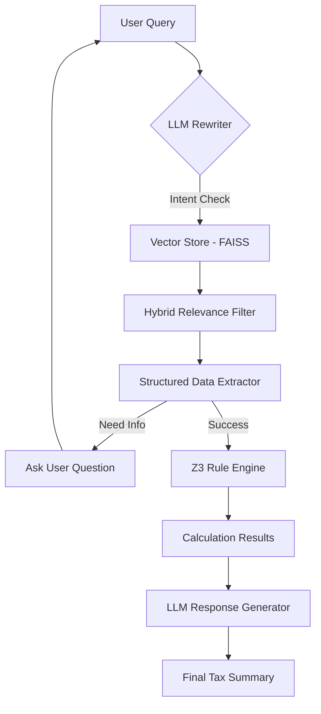

# Income Tax Chatbot: RAG + Rule Engine

A powerful, self-adapting AI assistant that combines **Retrieval-Augmented Generation (RAG)** with a formal **Z3-based Rule Engine** to provide accurate income tax calculations and advice.

Unlike standard chatbots that might "hallucinate" tax numbers, this system uses LLMs for natural language understanding and extraction, while delegating the actual math and logic to a verified rule engine.

---

## 🚀 Key Features

- **Natural Language Data Extraction**: Extracts complex tax scenarios from user chat.
- **Adaptive Dialogue**: Asks follow-up questions if critical information (like age or specific deductions) is missing.
- **Formal Verification**: Uses the **Z3 Theorem Prover** to ensure tax calculations are logically consistent and accurate.
- **Regime Comparison**: Automatically compares **Old vs. New Tax Regimes** to suggest the best path for the user.
- **Context-Aware Retrieval**: Uses FAISS to pull relevant sections from tax laws and circulars.

---

## 🛠️ Project Structure

```text
.
├── api.py                  # FastAPI server for frontend integration
├── main.py                 # CLI entry point for testing the pipeline
├── config.py               # Global configurations (models, paths, thresholds)
├── requirements.txt        # Python dependencies
├── rag/                    # RAG pipeline modules
│   ├── retriever.py        # FAISS retrieval logic
│   ├── query_rewriter.py   # Intent classification & query expansion
│   ├── structured_generator.py # Extraction of JSON from text
│   └── final_response_generator.py # Natural language synthesis
├── rule_engine/            # formal logic & tax rules (Z3-based)
├── data/                   # Knowledge base
│   ├── rag_docs/           # Place your PDF/Text tax documents here
│   └── faiss_index/        # Persistence for vector store
└── frontend/               # React/Vite development server
```

---

## 🔄 The Flow



1.  **Query Processing**: The query is rewritten for better search and classified (Tax-related vs. General).
2.  **RAG Retrieval**: Relevant chunks of Indian Tax Laws are fetched from the vector store.
3.  **Data Extraction**: The LLM extracts a JSON schema containing income, deductions (80C, 80D, etc.), and user profile details.
4.  **Formal Validation**: The JSON is passed to the Z3-based validator which calculates the tax liability for both regimes.
5.  **Synthesis**: The final result is converted back into a friendly, professional explanation.

---

## ⚙️ Setup & Installation

### 1. Prerequisites
- Python 3.9+
- Node.js & npm (for frontend)
- A Google Gemini API Key

### 2. Backend Setup
1.  **Clone the repo**:
    ```bash
    git clone https://github.com/BugBuster18/Income_tax_chatbot.git
    cd Income_tax_chatbot
    ```
2.  **Install dependencies**:
    ```bash
    pip install -r requirements.txt
    ```
3.  **Environment Variables**:
    Create a `.env` file in the root directory:
    ```env
    GEMINI_API_KEY=your_api_key_here
    ```
4.  **Initialise Data**:
    Add your tax law documents (TXT files) to `data/rag_docs/`. The first time you run the app, it will build the FAISS index automatically.

### 3. Frontend Setup
```bash
cd frontend
npm install
```

---

## 🏃 Running the Project

### Option A: Web App (Recommended)
1.  **Start the Backend**:
    ```bash
    python api.py
    ```
    The API will run at `http://localhost:8000`.

2.  **Start the Frontend**:
    ```bash
    cd frontend
    npm run dev
    ```
    Open your browser at the URL provided by Vite (usually `http://localhost:5173`).

### Option B: CLI Mode
For quick testing in the terminal:
```bash
python main.py
```

---

## 📝 Technologies Used

- **LLM**: Google Gemini 2.5 Flash (via `google-genai`)
- **Vector DB**: FAISS
- **Formal Logic**: Z3 Theorem Prover
- **Backend**: FastAPI
- **Frontend**: React + Vite (Tailwind CSS)
- **Data Persistence**: NumPy/JSON
